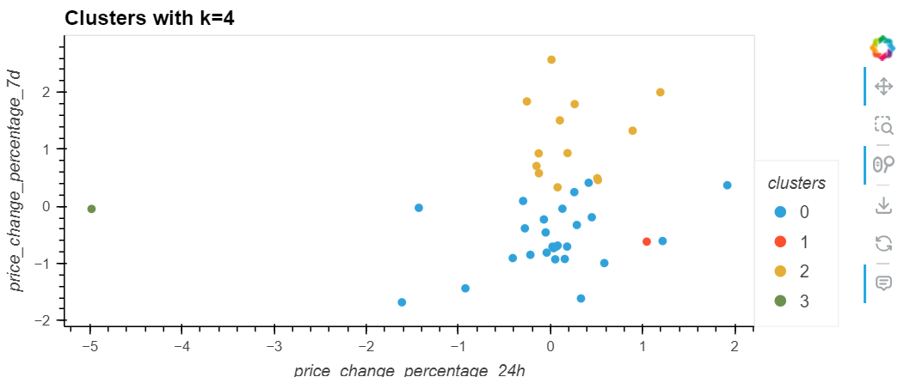

# UofT - Data Analysis Boot Camp

### Module 19 Unsupervised Learning (Unsupervised Machine Learning)

### CryptoClustering-challenge

### Background

For this project, I used unsupervised machine learning to predict the future prices of various types of crypto currency.

I was able to create visualizations of the data and simulate the most likely trajectory of the prices.- Javascript

**Question:** What is the total explained variance of the three principal components?

**Answer:** 89%

 **Question:** What is the best value for `k` when using the PCA data?

**Answer:**  3

**Question:** Does it differ from the best k value found using the original data?

**Answer:** Yes, 4 was the better for the original data.

**Question:** After visually analyzing the cluster analysis results, what is the impact of using fewer features to cluster the data using K-Means?

**Answer:** Reducing the features changed the inertia. So PCA had better results for clusters compared to the scaled data. By using the optimal value of 2 from the PCA, we saw more precise clustering.
